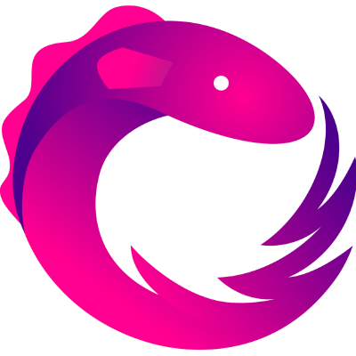

  

  
  
    

# 👋 **Hola Mundo**

    
    Soy Yemi Genderson Canchari Lizarbe, una persona con habilidades de desarrollo de sistemas web, android, desktop con tecnologias que estan a la vanguardia y siempre de la mano con las buenas practicas usando patrones de diseño, manteniendo una arquitectura limpia

# 🧑🏻‍💻 Mis Tecnologias
* **Frontend**: Angular, NgRx, React, Redux, html, css, js, scss, material ui, webpack, pug, scss 
* **Backend**: Java, Spring Boot, Spring Security, Spring Webflux, Spring Cloud, Jpa, Hibernate, Thymeleaf, Open Api(Swagger), microservices, RxJava, Jacoco, SpotBug, Mockito, Junit, Apache Kafka, Scala, Apache spark
* **Database**: SqlServer, MongoDb, Redis, Oracle
* **DevOps**: Docker, Git, Kubernetes, Sonar, Jenkins, Hashicorp Vault, Zipkin, ELK, Dynatrice, Grafana
* **Plataformas**: Linux, Windows
* **Mobile**: Kotlin, React Native
* **Metodologias**: Scrum, kanbam, Jira, Trello 
* **Idiomas**: Español, Ingles
* **Cloud**: Heroku, Digital Oceans, Azure, Firebase, Vercel, Netifly

# 🎓 Languages and tools

# 🚩 Investigando

* Blockchain
* Hyperledger

# 📞 Contactame

